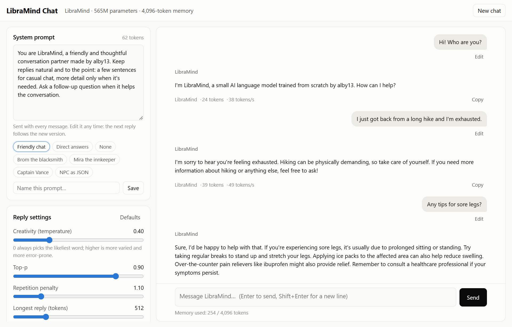
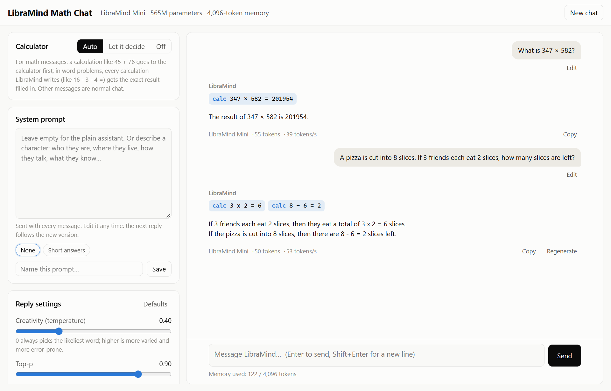

# LibraMind-AI

Software for the LibraMind AI LLM.

## LibraMind Chat

A browser chat app for **[LibraMind Mini](https://huggingface.co/alby13/LibraMindMini)**, a 565-million-parameter language model trained from scratch by alby13 on a single RTX 4090. LibraMind Mini is built for conversation and role-play, especially game NPCs.

There is also **[LibraMind Math Chat](#libramind-math-chat)**, a second app that gives LibraMind a calculator.

<picture>
  <source media="(prefers-color-scheme: dark)" srcset="docs/screenshot-dark.png">
  
</picture>

## Features

- **Streaming replies**, about 90–130 tokens per second on an RTX 4090. Stop, regenerate, and edit-and-resend.
- **A system prompt you can change at any point.** It's sent with every message, so the next reply follows the new version. The conversation marks where it changed.
- **Ready-made prompts and characters:**
  - Friendly chat
  - Direct answers
  - Brom the blacksmith
  - Mira the innkeeper
  - Captain Vance (quest giver)
  - an NPC that replies in JSON

  You can save your own prompts too.
- **JSON mode.** Replies are forced to be valid JSON matching a schema you supply, with grammar-constrained decoding. That makes it easy to turn a character's reply into a game action such as `open_shop` or `give_item`.
- **Settings:** temperature, top-p, repetition penalty and longest reply. The defaults come from a blind test (see below).
- **A memory meter** for the 4,096-token context. When a long chat no longer fits, the oldest messages are dropped, but the system prompt is always kept.
- **Your conversation, settings and saved prompts stay in your browser**, so a reload keeps them.

## Requirements

- An **NVIDIA GPU** with about 2–3 GB of free VRAM. LibraMind's Gated DeltaNet layers run as Triton GPU kernels, so CPU-only and Apple Silicon machines aren't supported.
- Python 3.10 or newer (tested with 3.12)
- Windows or Linux

## Install

1. Get the code:

   ```bash
   git clone https://github.com/alby13/LibraMind-AI
   cd LibraMind-AI
   ```

2. Install PyTorch with CUDA by following [pytorch.org/get-started](https://pytorch.org/get-started/locally/). It was tested with PyTorch 2.14 and CUDA 13.0.
3. Install the other packages:

   ```bash
   pip install -r requirements.txt
   ```

On Windows, this also installs `triton-windows`, which provides the GPU kernels.

## Run

```bash
python chatui.py
```

The first run downloads the model from Hugging Face (about 1.1 GB). Your browser then opens at http://127.0.0.1:8052.

| Option | What it does |
|---|---|
| `--model PATH_OR_REPO` | A local copy of the model folder, or another Hugging Face repo (default: `alby13/LibraMindMini`) |
| `--port 8060` | Use a different port |
| `--host 0.0.0.0` | Let other devices on your network connect |
| `--no-browser` | Don't open a browser tab |

## Recommended settings

The defaults come from a blind test. LibraMind Mini answered 31 everyday conversations: small talk, advice, explanations, creative requests, practical tasks, opinions and multi-turn chats. It did so under 22 sampling settings and 8 system prompts. Then the samples were scored every reply 1–10 without knowing which setting produced it.

- **Sampling: temperature 0.4, top-p 0.9, repetition penalty 1.1.**
  - Temperature 1.0 was clearly worse.
  - A repetition penalty of 1.2 hurt at temperature 0.6 and above.
  - The best settings between temperature 0.2 and 0.8 were close.
- **Use a system prompt.** Any reasonable one scored about a full point higher than none (5.3–5.6 vs 4.4 out of 10).
  - **Friendly chat** (the default) is the most consistent, and the best of the top prompts in multi-turn conversations.
  - **Direct answers** scored highest on explanations and creative requests, but is weaker in longer back-and-forth chats.

## Writing characters

Put the character card in the system prompt. Include who they are, where they are, how they speak, and **any facts they must get right**, such as prices, names and quest details. For example:

```
You are Mira, the cheerful innkeeper of the Gilded Goose inn in the village of Ashford. A room costs 5 silver a night and a bowl of stew costs 2 silver. You love local gossip. Stay in character, speak warmly, and keep replies to two or three sentences.
```

For game actions, switch **Reply format** to **JSON** and click **Use the NPC example**. That schema has the fields `line`, `emotion` (happy, angry, sad, neutral, surprised or afraid) and `action` (none, give_item, attack, open_shop, leave or follow_player). Describe the fields in the system prompt too, so the content makes sense as well as the format.

## Using it from a game or script

The page talks to a small local HTTP API, and you can call it from your own code.

`POST /api/chat` with a JSON body:

```json
{
  "system": "You are Brom, a gruff dwarven blacksmith...",
  "messages": [{"role": "user", "content": "Can you fix my sword?"}],
  "temperature": 0.4, "top_p": 0.9, "rep_penalty": 1.1, "max_new": 256,
  "schema": {"type": "object", "properties": {"line": {"type": "string"}}, "required": ["line"]}
}
```

`schema` is optional; add it to force JSON output. The response streams as one JSON object per line:
- first `{"start": true, "prompt_tokens": ..., "dropped": ...}`
- then `{"delta": "..."}` pieces of text
- finally `{"done": true, "text": "<the full reply>", "tokens": ..., "seconds": ...}`

Close the connection to stop a reply early.

`GET /api/status` returns the model's name, size and context length.

The server answers one request at a time and is meant for your own machine. Don't expose it to the internet.

## LibraMind Math Chat

On its own, LibraMind Mini is bad at arithmetic: it gets about 1 in 4 two-digit sums right and almost no three-digit ones. Math Chat is a separate chat app that gives it a calculator. Every calculation is shown above the answer, so you can check it.

```bash
python mathchat.py
```

It opens at http://127.0.0.1:8055 and takes the same options as `chatui.py`. Both apps can run at the same time; each loads its own copy of the model.

<picture>
  <source media="(prefers-color-scheme: dark)" srcset="docs/mathchat-dark.png">
  
</picture>

### What it does well

- **Any calculation you type.** Adding, subtracting, multiplying and dividing numbers of any size, decimals, money, numbers with commas (1,250.75), brackets, percentages ("12% of 50"), powers (2^10) and square roots. On a test of 850 arithmetic questions it got 99.2% right, up from 26% without the calculator.
- **Simple one-step word problems,** like "Tom has 37 apples and buys 48 more. How many does he have now?" It got 92% right, up from 66%.
- **Follow-up questions.** Ask for another calculation later in the conversation and it still uses the calculator.
- **Ordinary chat still works.** The calculator only steps in when a message contains a calculation, or numbers together with a math word such as "how many", "total", "cost" or "percent". Everything else gets a normal reply.

### How it works

In the default **Auto** mode, a math message is handled in one of two ways:

1. **A question that is a calculation** ("What is 347 × 582?") goes straight to the calculator. LibraMind's reply has to begin with a calculator call; the calculation is worked out exactly, and LibraMind writes its answer from the result.
2. **A word problem** is answered in LibraMind's own words, step by step. Whenever it writes a calculation followed by "=", such as "3 * 2 =", the calculator fills in the exact result before LibraMind can guess.

Why two ways? When LibraMind was given the calculator as a tool for word problems, it tried to squeeze the whole problem into a single calculation and usually set it up wrong. Its GSM8K score fell from 12% to 5.5%, or 3.5% when it had to use the tool. Letting it reason in its own words, and correcting only the arithmetic, works better.

You can also pick **Let it decide**, which offers the calculator and lets LibraMind choose (it often answers in its head instead), or **Off**.

The calculator is safe. It only understands numbers, + - * / % and powers, brackets and a few functions such as `sqrt`; nothing you type is run as code.

### Where it struggles: GSM8K word problems

GSM8K is a well-known test of grade-school math word problems. Each one takes 2 to 8 steps, for example working out a price, then a discount, then a total. We used 400 of its problems:

| | Score |
|---|---|
| LibraMind Mini on its own | 12.2% |
| Math Chat (Auto) | **18.0%** |

The calculator helps, but most of these problems are still answered wrong. Nearly all of the remaining mistakes happen before any arithmetic: LibraMind sets the problem up wrong, and a calculator can't fix that. Real examples from the test:

- **Combining the wrong numbers.** Janet's ducks lay 16 eggs a day; she eats 3 and bakes with 4, and sells the rest at $2 each. LibraMind multiplied 3 × 4 = 12 instead of adding 3 + 4 = 7, and answered $8 instead of $18.
- **Leaving a part out.** Toulouse has 160 sheep, Charleston 80 and Seattle 20. Asked for the total, it added only 160 + 20 = 180 and forgot Charleston (the answer is 260).
- **Applying a rule to everything.** When every second glass is cheaper, it priced all 16 glasses at the cheaper price ($48 instead of $64). In another problem it paid overtime on all 45 hours worked instead of the 5 extra hours.
- **Losing track of units or the story.** "200 GB at 2 GB per minute" became "100 seconds". In a long driving problem it lost track of which way the car was going.
- **Words inside a calculation.** In "2 bolts + 2.5 bolts =", the words between the numbers hide the calculation from the calculator, so LibraMind's own wrong guess (4) stays.

### Characters

In a character role, such as an innkeeper, LibraMind usually answers in character without writing out its working. In Auto mode that leaves the calculator nothing to correct. We asked 5 shop and inn price questions, twice each, such as "I want two swords and a shield. What's the total?" Math Chat got 0 of 10 right in Auto mode and 1 of 10 in Let it decide. The calculator did the sums it was given exactly, but LibraMind picked the wrong numbers to add: two 40-gold swords and a 25-gold shield became 40 + 25 = 65. For prices and totals in a game, it's still safest to compute them in your own code.

### Full results

These use the LibraMind Mini model currently on Hugging Face, always picking the likeliest word (temperature 0). The arithmetic test has 850 questions, from single digits up to 3+ digit numbers, plus simple one-step word problems.

| | On its own | Tool, LibraMind decides | Tool, forced | Inline only | **Auto** |
|---|---|---|---|---|---|
| Single-digit arithmetic | 84.7% | 100% | 100% | 86.7% | **100%** |
| 2-digit arithmetic | 23.2% | 99.2% | 99.2% | 76.4% | **99.2%** |
| 3+ digit arithmetic | 0.8% | 99.8% | 99.8% | 67.2% | **99.8%** |
| One-step word problems | 66% | 22% | 22% | 92% | **92%** |
| All 850 arithmetic questions | 26.0% | 95.1% | 95.1% | 74.8% | **99.2%** |
| GSM8K (400 problems) | 12.2% | 5.5% | 3.5% | 18.5% | **18.0%** |

- **On its own:** no calculator.
- **Tool, LibraMind decides:** the calculator tool is offered for every question.
- **Tool, forced:** every reply has to start with a calculator call.
- **Inline only:** no tool; the calculator only fills in results after "=".
- **Auto:** what Math Chat does. Calculations go to the tool, word problems use the inline calculator.

Inline only scored slightly higher on GSM8K (two more problems right), but it misses many plain calculations, because LibraMind doesn't always write them out with "=".

### Using it from code

`POST /api/chat` takes the same body as LibraMind Chat (without `schema`), plus `"calculator": "auto"`, `"offer"` or `"off"`. The stream adds one `{"calc": {"expression": "347 × 582", "result": 201954}}` line per calculation, and the final `done` line lists them all in `calcs`.

## Limitations

LibraMind Mini is a small model trained on a hobby budget:
- **Facts:** it often states wrong or invented facts confidently.
- **Math:** it fails at arithmetic beyond single digits. [Math Chat](#libramind-math-chat) fixes the arithmetic, but not the reasoning.
- **Code:** it rarely writes correct code.
- **Memory:** in long conversations it loses track of details mentioned more than a few hundred words earlier.

It's good company for chatting and characters, but check anything that matters, and compute numbers such as prices and totals in your own code. There was no dedicated safety training, so filter its output before showing it to the public. See the [model card](https://huggingface.co/alby13/LibraMindMini) for full evaluations.

## Files

| File | What it is |
|---|---|
| `chatui.py` | The local server: loads the model, streams replies, applies JSON schemas |
| `chatui.html` | The chat page |
| `mathchat.py` | The Math Chat server: decides when to use the calculator and runs the calculations between steps of the reply |
| `mathchat.html` | The Math Chat page |
| `calctools.py` | The calculator (a safe arithmetic evaluator), the `calculate` tool definition, and the inline calculator |
| `model.py`, `inference.py`, `chat_format.py` | LibraMind Mini's architecture, fast generation (cached and CUDA-graph decoding, grammar-forced JSON and tool calls, inserted text), and chat template |

## License

This software may be used and modified only to run the LibraMind Mini AI model. See [LICENSE](LICENSE).

The model weights are published separately on [Hugging Face](https://huggingface.co/alby13/LibraMindMini) under their own license. See the model card.
